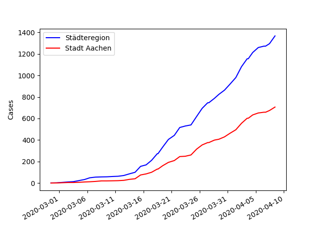
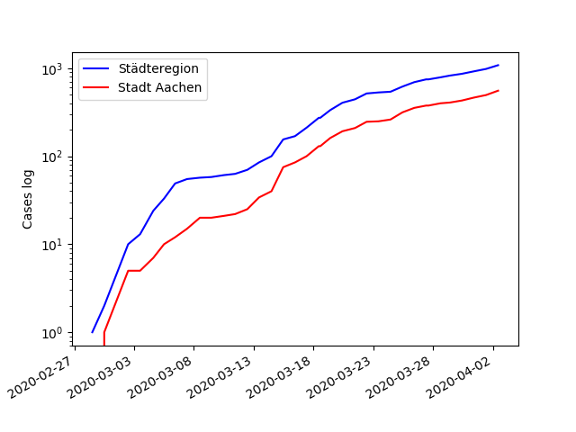
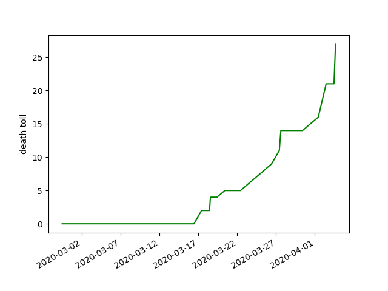
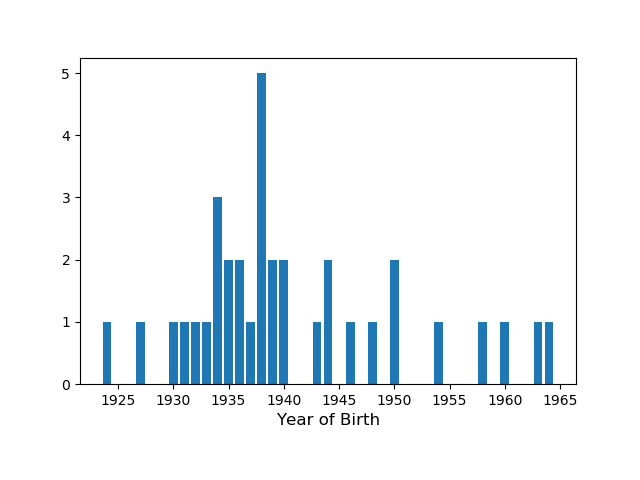
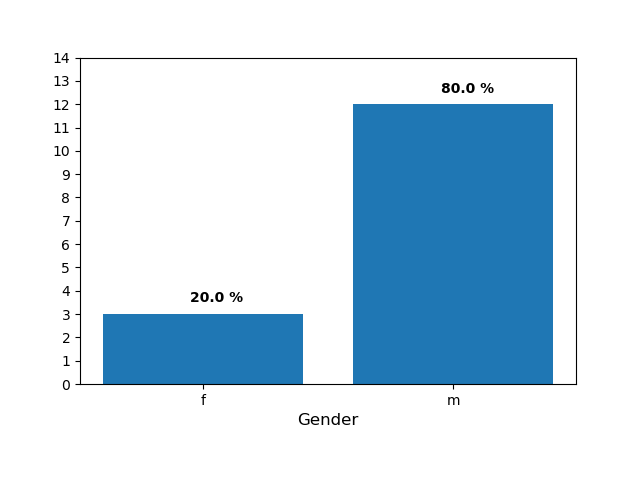

--- 
 title: Covid19 in Aachen (Stadt und Städteregion) 
 date: "2020-04-06T18:32:54.000Z" 
--- 
The city of Aachen publishes (more or less) daily updates about Covid19. It's in the form of a daily press release, so I decided to collect this data to make it more usable for further processing ([google spread sheet](https://docs.google.com/spreadsheets/d/1Th4GSgmTpX4GtcebVDzIfRuCOu2cSOc2WJCORHcCw-Y)).

Below is the development of cases in the Städteregion Aachen and the city of Aachen: 
And on a log scale: 
And the current death toll: 
And the year of birth of the deceased. Their average (median) year of birth was 1938. Which corresponds to an average age of 82.
And the gender distribution of the deceased. 66.0 % of victms were male.

## How this site is generated 
 This site is automatically generated when data is added to the [spread sheet](https://docs.google.com/spreadsheets/d/1Th4GSgmTpX4GtcebVDzIfRuCOu2cSOc2WJCORHcCw-Y). You can find the corresponding python script inside my [github repository](https://github.com/lucasgerads/blog/blob/master/content/blog/Covid19/main.py).

 ##Source
Source: [Stadt Aachen](http://www.aachen.de/DE/stadt_buerger/notfall_informationen/corona/aktuelles/pressemitteilungen/index.html)